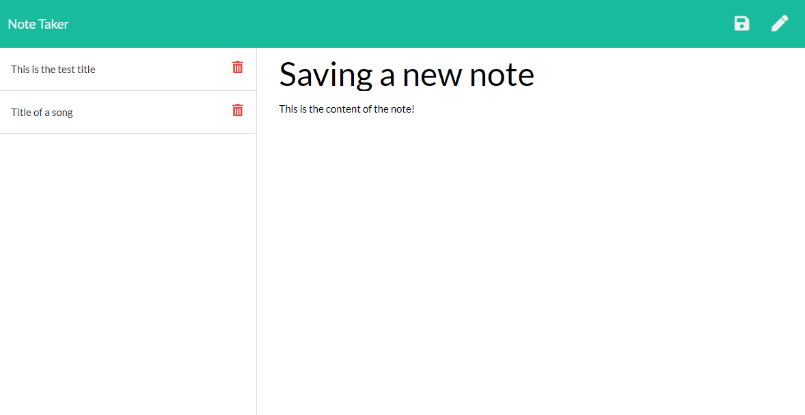

[](https://opensource.org/licenses/MIT)
# Note Taker App

## Description

This is a simple note taking application built to practice using back-end servers with Express.js. With this application, users will be able to write simple notes to save, re-access or delete across devices. 


---------------------------

The deployed and functional site can be found here: <https://note-taker-swv.herokuapp.com/>

The full process can be found on my [Github](https://github.com/spencerv86/) repository linked here:
<https://github.com/spencerv86/note-taker>


---------------------------

## Table of Contents

* [Installation](#installation)
* [Usage](#usage)
* [Credits](#credits)
* [License](#license)


## Installation

If you would like to inspect the code, begin by forking the repository and downloading to your computer. Make sure that you have node already installed. 
You may need to run 
```npm init``` or ```npm install``` but no other files should be necessary. Run ```npm start``` to create the server locally.

If you would simply like to see the app in action, no installation is needed, just click the following link: <https://note-taker-swv.herokuapp.com/>

## Usage

To use the application, simply type in the title and text of your note/memo and click the save button in the top right corner. If you would like to navigate to a previous note, clicking on the relevant title on the left column will load that note. To write a new note, the pencil button in the top right corner will re-opne the note editor. If you no longer need a note, clicking the trashcan icon next to the relevant title will delete that note. This is permanent so be careful!



## Credits

Thanks to the teaching staff and my fellow classmates in my cohort! 

## License

MIT License

Copyright (c) 2021 Spencer Vaughan

Permission is hereby granted, free of charge, to any person obtaining a copy
of this software and associated documentation files (the "Software"), to deal
in the Software without restriction, including without limitation the rights
to use, copy, modify, merge, publish, distribute, sublicense, and/or sell
copies of the Software, and to permit persons to whom the Software is
furnished to do so, subject to the following conditions:

The above copyright notice and this permission notice shall be included in all
copies or substantial portions of the Software.

THE SOFTWARE IS PROVIDED "AS IS", WITHOUT WARRANTY OF ANY KIND, EXPRESS OR
IMPLIED, INCLUDING BUT NOT LIMITED TO THE WARRANTIES OF MERCHANTABILITY,
FITNESS FOR A PARTICULAR PURPOSE AND NONINFRINGEMENT. IN NO EVENT SHALL THE
AUTHORS OR COPYRIGHT HOLDERS BE LIABLE FOR ANY CLAIM, DAMAGES OR OTHER
LIABILITY, WHETHER IN AN ACTION OF CONTRACT, TORT OR OTHERWISE, ARISING FROM,
OUT OF OR IN CONNECTION WITH THE SOFTWARE OR THE USE OR OTHER DEALINGS IN THE
SOFTWARE.